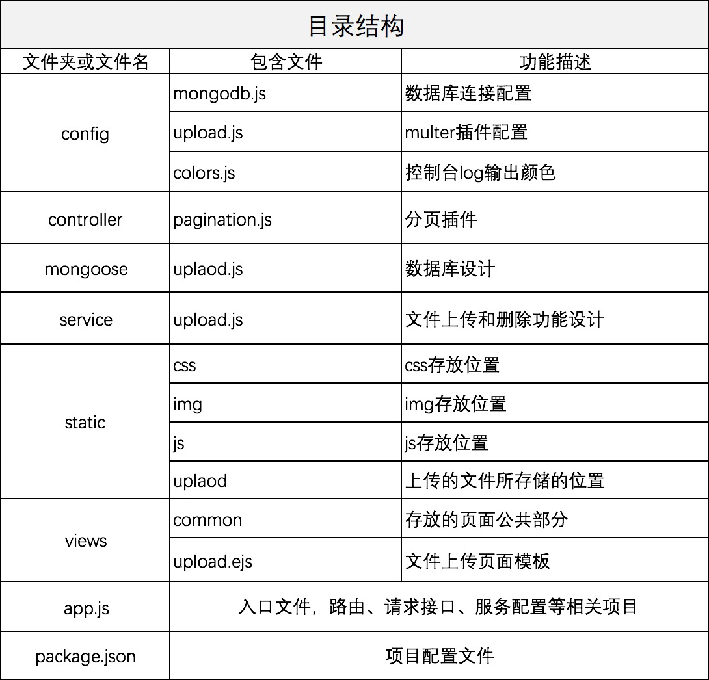

# upload
基于nodejs的文件上传存储功能
#开发环境
- Node.js: `6.9.1`
- MongoDB: `3.2.10`
- Express: `^4.15.3`
## 简介
1.框架选用的为express 4.*版本，文件上传选用了multer插件，数据库选用mongodb非关系型数据库，页面模版使用ejs模版，分页插件为我自己编写的一个插件。

2.会详细介绍上传控件multer的配置项，mongodb数据库线上和本地连接，mongodb创建schemas和model的方法和如何调用。

## 项目下载
```
git clone https://github.com/zhaoxuhui1122/FileUplaod.git
```
## 初始化
```
npm install
```
## 运行
```
node app
```
# 关于项目的详细讲解
## 1.目录结构


## 2. 框架及插件选用
- Node.js: `6.9.1`
- MongoDB: `3.2.10`
- Express: `^4.15.3`
- Bluebird: "^3.5.0`
- Body-parser: `^1.17.2`
- Colors: `^1.1.2`
- Ejs: `^2.5.6`
- Moment: `^2.18.1`
- Mongoose:`^4.11.3`
- Multer: `^1.3.0`

## 3.页面路由定义，实现页面访问
页面模板引擎选用的为ejs模板，首先在app.js中定义页面模板为ejs
```javascript
const ejs = require("ejs");
app.set("views", "./views"); //设置页面模版根目录
app.set("view engine", "ejs"); //设置默认模板引擎
```
定义路由，此处由于只有一个页面，设置根目录为上传页面
```javascript
app.get("/",function(req,res){
    res.render("upload");
})
```
## 4.文件上传功能的实现
文件上传此处实用的multer插件
关于multer的相关配置参考/config/upload.js
首先定义上传文件的请求接口
```javascript
app.post("/upload/file", uploadConfig.single('file')); //文件上传  file为表单内input的name
//做到这里其实已经实现文件上传的功能了
//剩余的工作就是将存储的文件相关的信息存入数据库，便于后期使用
```
## 5.上传文件信息存储
/config/upload.js 内已经将文件的一些属性进行了修改，如文件名，方便在service层调用

- 首先设计数据库字段，由于此处只做示例，将mongoose的schemas和model全部定义在了一起，构建复杂项目可分开
```javascript
const mongoose = require("mongoose");
//定义模式 schemas
//schemas 所需存储的字段以 键值:值类型的模式定义
var uploadSchemas = new mongoose.Schema({
    name: String,
    url: String,
    type: String,
    size: String,
    createAt: Date
});
//定义模型 model
var Upload = mongoose.model("Upload", uploadSchemas);
module.exports = Upload;
```
- 设计文件存储和删除功能
[/service/upload.js](./service/upload.js)

- 定义请求接口
```javascript
const uplaodService = require("./service/upload");
app.post("/upload/file", uploadConfig.single('file'), uplaodService.add); //文件上传
app.post("/remove/file", uploadConfig.single('file'), uplaodService.remove); //文件删除
```
至此，文件上传和删除的接口已经完成

## 5.分页功能的实现
后台分页插件为[pagination.js](./controller/pagination.js),可根据自己的需求扩展
页面路由配置项
```javascript
const pagination = require("./controller/pagination");
app.get("/", function(req, res) {
    //限查出数据库内所有的数据
    Upload.find({}, function(err, files) {
        if (err) {
            console.log(err);
            return;
        }
        //按创建时间排序
        files = files
            .sort("createAt")
            .reverse();
        //分页 调用分页插件
        var result = pagination(req.query, files);
        //响应对应的页面
        res.render("upload", {
            result: result
        });
    })
})
```
页面分页按钮组扩展插件在conmon.js内
关于页面数据绑定可参考网上ejs的具体用法，这里只用到了简单的判定和循环列表
## 【注意】 上传文件的form表单需要定义属性 enctype="multipart/form-data

## 关于mongodb安装及管理
此处不对mongodb的安装做具体的介绍，安装过程中会碰到各种问题，需要自己去摸索试探
mongodb桌面管理工具个人使用的是Robomongo


